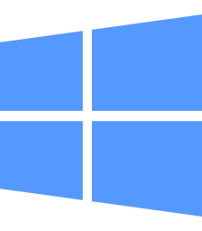

<!-- badges: start -->

[](https://mybinder.org/v2/gh/IdoBar/3030NSC_Workshop6_DGE/main?urlpath=rstudio)
<!-- badges: end -->


# 3030NSC Workshop6 - Differential Gene Expression (Binder-ready)

This repository was developed as an educational tutorial/workshop for
the Applied Bioinformatics course (3030NSC/7104ESC) offered at Griffith
University (see [course
details](https://www.griffith.edu.au/study/courses/applied-bioinformatics-3030NSC)).
The tutorial covers basic differential gene expression analysis and
visualisation in R using `DESeq2`.  
The teaching material for the workshop was developed by Dr. Alex
Cristion (<a.cristino@griffith.edu.au>) and prepared as a
[Binder](https://mybinder.org/) repository by Dr. Ido Bar
(<i.bar@griffith.edu.au>).  
The tutorial is setup to be run live and interactively in class either
setup locally on the students’ computers or using
[Binder](https://mybinder.org/) (see instructions below).

## Instructions

<!-- ### {height=1em width=1.13em} -->

### R

R is a programming language and free software environment for
statistical computing and graphics supported by the R Foundation for
Statistical Computing. The R language is widely used among statisticians
and data miners for developing statistical software and data analysis.

### RStudio

RStudio is a set of integrated tools designed to help you be more
productive with R. It includes a console, syntax-highlighting editor
that supports direct code execution, and a variety of robust tools for
plotting, viewing history, debugging and managing your workspace. It
requires R to be installed prior to be able to send commands to the
interpreter.

### Using R and RStudio from Cloud services

If we want to keep things simple (for this course) or we would like to
use R on shared computers, where we can’t install software, we can run R
and Rstudio through a web client that is hosted on a remote server.  
We will use the [Binder](https://mybinder.org/) service, which is free,
easy to use and can be launched from a single GitHub repository (more
about this in the workshop).

#### Running R and RStudio on Binder

Using Binder is as simple as clicking on the Binder badge - <a
href="https://mybinder.org/v2/gh/IdoBar/3030NSC_Workshop6_DGE/main?urlpath=rstudio"
target="_blank"></a>.  
Alternatively, you can navigate to the
<a href="https://mybinder.org/" target="_blank">Binder</a> homepage and
enter the URL of this tutorial
<a href="https://github.com/IdoBar/3030NSC_Workshop6_DGE.git"
target="_blank">GitHub repository</a>
`https://github.com/IdoBar/3030NSC_Workshop6_DGE.git` and click on the
**launch** button (see screenshot in Figure 1 below).

<div class="figure" style="text-align: center">


<p class="caption">
Figure 1: Binder launch screenshot.
</p>

</div>

Now be patient while the environment is loading…  
You should now see in your web browser an RStudio interface (if you got
to the Jupyter page, click on new –\> RStudio) and are ready to start
working in R in “The Cloud”! 

#### Downloading files from Binder

After we’ve finished working on Binder we would like to download the R
script that we wrote and any output files (summary tables and figures).
We can access those files by using the `files` tab in RStudio (bottom
right pane).  
Select the files/folders that you would like to download and click on
More  Export… (see screenshot in Figure 2
below) to save the file on your computer.

<div class="figure" style="text-align: center">


<p class="caption">
Figure 2: Download files from Binder/RStudio screenshot.
</p>

</div>

### Installing R and RStudio locally

Alternatively, both R and RStudio can be installed locally on any
operating system (, , or , see a <a
href="https://www.datacamp.com/community/tutorials/installing-R-windows-mac-ubuntu%20"
target="_blank">detailed tutorial</a>), which provides complete control
over the installation, added packages and can be used anywhere without
requiring internet connection. This is recommended for anyone who is
planning to do any future serious analysis in R (including the
assignments in this course).

#### Project Management with RStudio

Regardless whether we installed R and RStudio locally or we use the
Binder service, we interact with R through the RStudio integrated
development environment (IDE), which let’s us easily write our code,
test it, see our files, objects in memory and plots that we produce. If
we run the analysis locally, it is highly recommended to use RStudio’s
built-in Projects to contain our analysis in its own folder with all the
files required. That will also help in reading data files and writing
results and figures back to the hard drive.

> 1.  Start RStudio by clicking on its icon.  
> 2.  Start a new project by selecting “File –\> New Project” or
>     clicking on the “New Project” icon (under “Edit” in the
>     taskbar).  
> 3.  Select “New Directory –\> New Project” and then enter “Workshop1”
>     in the Directory name text box and browse to the “wrokspace”
>     folder to create the project folder in (see screenshots A-D in
>     Figure 3 below)

<div class="figure" style="text-align: center">


<p class="caption">
Figure 3: Create a new project in RStudio screenshots.
</p>

</div>

> 4.  Create a new R script file by selecting “File –\> New File –\> R
>     Script” or clicking on the “New File” icon (under the “File” in
>     the taskbar)  
> 5.  Save the script file by select “File –\> Save” or pressing Ctrl+s
>     or clicking on the floppy disk icon on the top bar

### Install Packages

R can be extended with additional functionality by installing external
packages (usually hosted at the Comprehensive R Archive Network
repository –
<a href="https://cran.r-project.org/web/packages/index.html"
target="_blank">CRAN</a>). To find which packages can be useful for your
type analysis, use search engine (Google is your friend) and the
available
<a href="https://cran.r-project.org/web/views/" target="_blank">Task
Views on CRAN</a>, which provide some guidance on which packages on CRAN
are relevant for tasks related to a certain topic. Another great source
for Genomics and Bioinformatics packages is BioConductor (see their list
of <a
href="https://www.bioconductor.org/packages/release/BiocViews.html#___Workflow"
target="_blank">suggested workflows</a>).

Please note that the required packages for this workshop are already
pre-installed in Binder, but they will need to be installed if you chose
to run the analysis locally.  
To install these packages, we use the `install.packages('package')`
command (or `BiocManager::install('package')` if installing from
BioConductor), please note that the package name need to be quoted and
that we only need to be perform it once, or when we want or need to
update the package. Once the package was installed, we can load its
functions using the `library(package)` command. *Note that in this case
we use the package name without quotes!*.

Installing new packages in R can sometimes be quite challenging and
time-consuming using the general approach described below, however, I
recently found an auxiliary package called
<a href="https://pak.r-lib.org/" target="_blank">pak</a>, that makes
installing other packages a breeze, reagrdless if their hosted on CRAN
or on BioConductor so we will use it throughout these workshops.

``` r
# install required packages - needed only once! (comment with a # after first use)
install.packages("pak")
# load the package
library(pak)
pkg_install("DESeq2")  
pkg_install("EnhancedVolcano")
```

### Additional Information

For more details and instructions how to setup a similar repository,
please visit [From Zero to Binder in
R!](https://github.com/alan-turing-institute/the-turing-way/blob/master/workshops/boost-research-reproducibility-binder/workshop-presentations/zero-to-binder-r.md)
